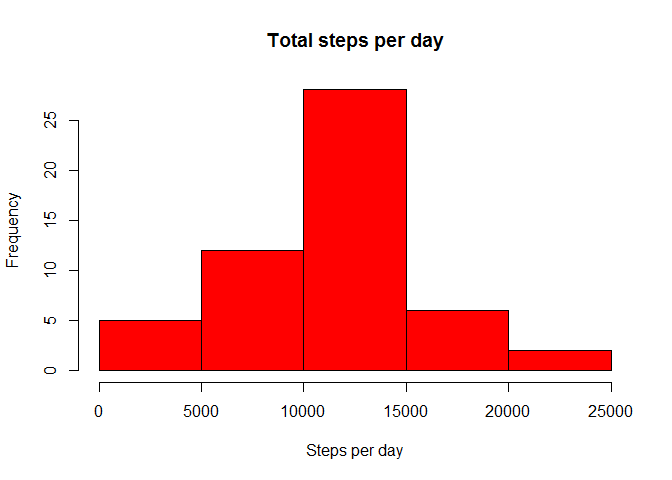
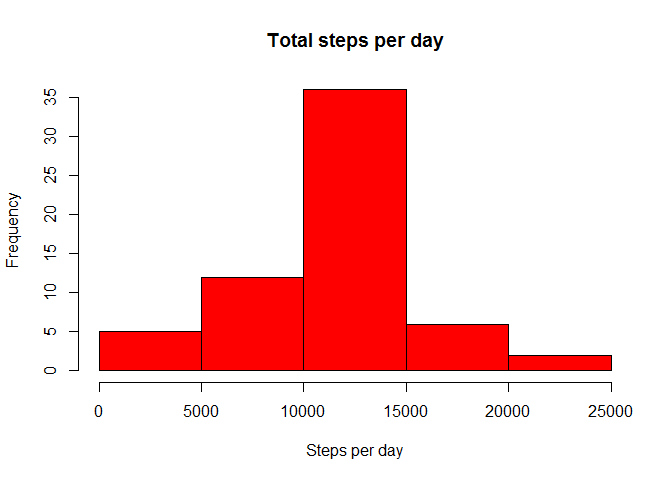
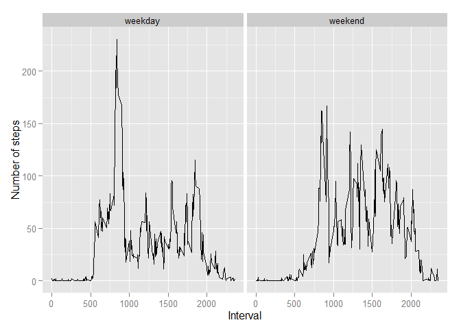

# Reproducible Research: Peer Assessment 1


## Loading and preprocessing the data


```r
## read data (set working directory to folder with file activity.zip)
data <- read.csv(unz("activity.zip", "activity.csv"), header = TRUE)
```

## What is mean total number of steps taken per day?

1. Total number of steps taken per day


```r
library(dplyr)    
```

```
## Warning: package 'dplyr' was built under R version 3.1.2
```

```
## 
## Attaching package: 'dplyr'
## 
## The following object is masked from 'package:stats':
## 
##     filter
## 
## The following objects are masked from 'package:base':
## 
##     intersect, setdiff, setequal, union
```

```r
# filter NA
f <- filter(data, is.na(steps)==0)
# group data by day
g <- group_by(f, date)
# summarise emissions
s <- summarise(g, total_steps=sum(steps))
```

2. Histogram of total number of steps taken each day


```r
hist(s$total_steps, col = "red", main = "Total steps per day", xlab = "Steps per day")
```

 

3. Mean and median of the total number of steps taken per day

Mean

```r
mean(s$total_steps)
```

```
## [1] 10766.19
```

Median

```r
median(s$total_steps)
```

```
## [1] 10765
```

## What is the average daily activity pattern?

1. Time series plot (i.e. type = "l") of the 5-minute interval (x-axis) and the average number of steps taken, averaged across all days (y-axis)


```r
# filter NA
f <- filter(data, is.na(steps)==0)
# group data by day
g <- group_by(f, interval)
# average steps
s <- summarise(g, avg_steps=mean(steps))
with(s, plot(interval, avg_steps, ylab = "Average steps", xlab = "Interval", type = "l"))
```

 

2. 5-minute interval, on average across all the days in the dataset, contains the maximum number of steps?


```r
filter(s, avg_steps == max(s$avg_steps))$interval
```

```
## [1] 835
```

## Imputing missing values

1. Total number of missing values in the dataset


```r
sum(is.na(data$steps))
```

```
## [1] 2304
```

2. Create a new dataset, an fill NA with mean of 5-interval previous calculated


```r
## fill with mean of interval
data_fill <- data %>%
                    group_by(interval) %>% 
                    mutate(steps= ifelse(is.na(steps), mean(steps, na.rm=TRUE), steps))
```

3. Generate histogram, mean and median


```r
# filter NA
f <- filter(data_fill, is.na(steps)==0)
# group data by day
g <- group_by(f, date)
# summarise emissions
s <- summarise(g, total_steps=sum(steps))
```


```r
hist(s$total_steps, col = "red", main = "Total steps per day", xlab = "Steps per day")
```

 

Mean

```r
mean(s$total_steps)
```

```
## [1] 10766.19
```

Median

```r
median(s$total_steps)
```

```
## [1] 10766.19
```

The values are almost the same as calculated in excluding NA. The median differs a little.

## Are there differences in activity patterns between weekdays and weekends?

1. Create a new factor variable in the dataset with two levels - "weekday" and "weekend"


```r
## set locale in english to avoid local day names
Sys.setlocale("LC_TIME", "English")
```

```
## [1] "English_United States.1252"
```

```r
data_fill$weekday_type <- 
    ifelse(weekdays(strptime(data_fill$date, format = "%Y-%m-%d"), abbreviate = TRUE) %in% c("Sat", "Sun"), 
		"weekend", 
		"weekday")
```

2. Plot containing a time series plot of the 5-minute interval (x-axis) and the average number of steps taken, averaged across all weekday days or weekend days (y-axis)


```r
gp <- group_by(data_fill, weekday_type, interval)
sp <- summarise(gp, avg_steps=mean(steps))
## plot
library(ggplot2)
```

```
## Warning: package 'ggplot2' was built under R version 3.1.2
```

```r
qplot(interval, avg_steps, data=sp, facets=.~weekday_type, geom=c('line')) +
    labs(x = "Interval", y = "Number of steps")
```

 


